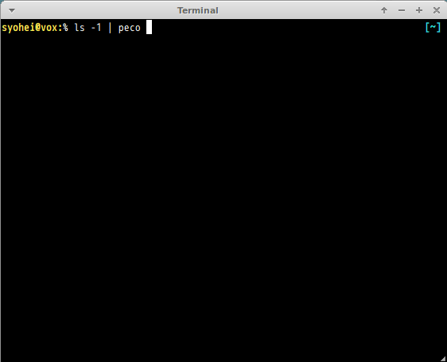

# zsh go completions
* godoc
* [gom](https://github.com/mattn/gom)
* [peco](https://github.com/peco/peco)
* [byzanz-window](https://github.com/syohex/byzanz-window)

## How to Use

### Download Repository

```
% git clone https://github.com/syohex/zsh-go-completions.git ~/.zsh/go-completions
% rm ~/.zcompdump # remove cache
```

### Zsh configuration

Add following code to your zsh configuration file(such as `~/.zshrc`)

```sh
fpath=(~/.zsh/go-completions $fpath)
```

### ScreenCast

#### peco


